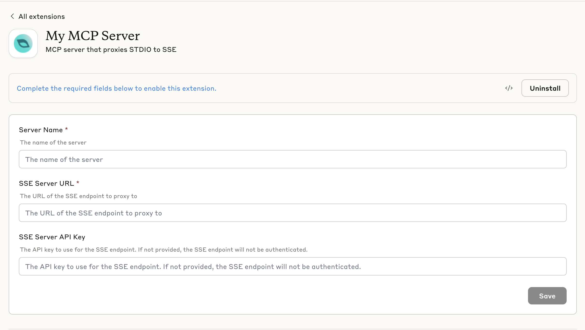

# MCP SSE Proxy

A Model Context Protocol (MCP) server that acts as a proxy, bridging STDIO-based MCP clients with SSE (Server-Sent Events) based MCP servers. This enables MCP clients that only support STDIO transport to connect to remote MCP servers that use SSE transport.

## Overview

The MCP SSE Proxy creates a bridge between two different MCP transport protocols:
- **STDIO Transport**: Used by local MCP clients (like Claude Desktop)
- **SSE Transport**: Used by remote MCP servers accessible via HTTP/HTTPS

This proxy allows you to use remote MCP servers that expose SSE endpoints from applications that only support STDIO-based MCP connections.

## Features

- **Full MCP Protocol Support**: Proxies all MCP capabilities including:
  - Tools (listing and calling)
  - Resources (listing and reading)
  - Resource Templates (listing)
  - Prompts (listing and getting)
- **Authentication Support**: Optional API key authentication for SSE endpoints
- **Error Handling**: Comprehensive error handling with detailed logging
- **Graceful Shutdown**: Proper cleanup on process termination
- **Configurable**: Flexible configuration via command line arguments or environment variables

## Installation

### Prerequisites

- Node.js >= 18.0.0
- npm or yarn

### Setup

1. Clone or download this repository
2. Install dependencies:

```bash
npm install
```

## Usage

### Command Line Arguments

```bash
node server/index.js <SERVER_NAME> <SSE_URL> [API_KEY]
```

**Parameters:**
- `SERVER_NAME`: Display name for the MCP server
- `SSE_URL`: URL of the remote SSE MCP server endpoint
- `API_KEY`: (Optional) API key for authentication

**Example:**
```bash
node server/index.js "My Remote MCP Server" "https://api.example.com/mcp/sse" "your-api-key"
```

### Environment Variables

Alternatively, you can use environment variables:

```bash
export SERVER_NAME="My Remote MCP Server"
export SSE_URL="https://api.example.com/mcp/sse"
export API_KEY="your-api-key"
node server/index.js
```

## Configuration

### MCP Client Configuration

To use this proxy with an MCP client like Claude Desktop, add the following to your MCP configuration:

```json
{
  "mcpServers": {
    "remote-server": {
      "command": "node",
      "args": [
        "/path/to/mcp-proxy-node/server/index.js",
        "Remote Server Name",
        "https://your-remote-server.com/mcp/sse",
        "your-api-key"
      ]
    }
  }
}
```

### Authentication

The proxy supports Bearer token authentication. When an API key is provided, it will be sent as:
- `Authorization: Bearer <API_KEY>` header in HTTP requests
- Authentication headers for EventSource connections

## Creating a Desktop Extension (.dxt)

This MCP proxy can be packaged as a Desktop Extension for easy one-click installation in Claude Desktop and other MCP-enabled applications.

For the complete guide, see: [Desktop Extensions: One-click MCP server installation for Claude Desktop](https://www.anthropic.com/engineering/desktop-extensions)

### Prerequisites

Install dependencies

```bash
npm install
```

Install the DXT CLI tool:

```bash
npm install -g @anthropic-ai/dxt
```

### Steps to Create DXT File

1. **Initialize DXT configuration** (if needed):
   ```bash
   dxt init
   ```
   
   Note: This project already includes a `manifest.json` file, so initialization may not be necessary.

2. **Validate the manifest**:
   ```bash
   dxt validate
   ```

3. **Package the extension**:
   ```bash
   dxt pack
   ```

4. **Test the extension**:
   - The command will generate a `.dxt` file
   - Drag the `.dxt` file into Claude Desktop's Settings window
   - Click "Install" to test the extension

### Quick Installation (Alternative)

If you don't want to build the extension yourself, you can directly drag and drop the pre-built `mcp-proxy-node.dxt` file into Claude Desktop's Settings window for immediate installation.

### Screenshots



*The MCP SSE Proxy extension as it appears in Claude Desktop after installation. Users can easily configure the server name, SSE URL, and API key through the intuitive interface.*


## Technical Details

### Architecture

```
MCP Client (STDIO) ←→ MCP SSE Proxy ←→ Remote MCP Server (SSE)
```

The proxy consists of two main components:

1. **MCP Server**: Accepts STDIO connections from local MCP clients
2. **MCP Client**: Connects to remote SSE MCP servers

### Transport Protocols

- **Input**: STDIO transport (standard input/output)
- **Output**: SSE transport (Server-Sent Events over HTTP/HTTPS)

### Error Handling

The proxy includes comprehensive error handling:
- Connection failures to remote SSE servers
- Invalid URL formats
- Authentication errors
- Request/response parsing errors
- Graceful degradation when remote capabilities are unavailable

### Logging

Detailed logging is provided via `console.error()` for debugging:
- Connection status
- Request/response details
- Error information with stack traces
- Performance metrics

## API Reference

### MCPSSEProxy Class

#### Constructor
```javascript
new MCPSSEProxy(sseUrl, apiKey, serverName)
```

- `sseUrl` (string): URL of the SSE MCP server
- `apiKey` (string, optional): API key for authentication
- `serverName` (string): Display name for the proxy server

#### Methods

- `initialize()`: Initialize client and server connections
- `run()`: Start the proxy server
- `close()`: Gracefully shutdown the proxy
- `setupProxyHandlers()`: Configure request handlers

## Development

### Project Structure

```
mcp-proxy-node/
├── server/
│   └── index.js          # Main proxy server implementation
├── package.json          # Project configuration and dependencies
├── manifest.json         # DXT manifest for MCP client integration
├── favicon.png          # Project icon
└── README.md            # This file
```

### Dependencies

- `@modelcontextprotocol/sdk`: Official MCP SDK for Node.js

### Contributing

1. Fork the repository
2. Create a feature branch
3. Make your changes
4. Test thoroughly
5. Submit a pull request

## Troubleshooting

### Common Issues

1. **Connection Refused**
   - Verify the SSE URL is correct and accessible
   - Check if the remote server is running
   - Ensure firewall/network settings allow connections

2. **Authentication Errors**
   - Verify the API key is correct
   - Check if the remote server expects authentication
   - Ensure the API key format matches server expectations

3. **No Tools/Resources Available**
   - Check if the remote server actually provides tools/resources
   - Verify the remote server is responding correctly
   - Check proxy logs for error messages

4. **Performance Issues**
   - Monitor network latency to the remote server
   - Check for rate limiting on the remote server
   - Consider connection pooling for high-frequency usage

### Debugging

Enable detailed logging by examining the console output. The proxy logs:
- Connection attempts and results
- Request/response details
- Error messages with stack traces
- Performance timing

## Join our community for help and updates

👉 **Slack Community -** [AI in Ads](https://join.slack.com/t/ai-in-ads/shared_invite/zt-36hntbyf8-FSFixmwLb9mtEzVZhsToJQ)

## Also checkout our other projects

👉 **Facebook Ads MCP -** [Facebook Ads MCP](https://github.com/gomarble-ai/facebook-ads-mcp-server)
👉 **Google Ads MCP -** [Google Ads MCP](https://github.com/gomarble-ai/google-ads-mcp-server)

## License

MIT License - see LICENSE file for details

## Support

For issues and questions:
- Check the troubleshooting section above
- Review the console logs for error details
- Ensure your Node.js version meets requirements (>= 18.0.0)
- Verify the remote SSE server is compatible with MCP protocol

## Compatibility

- **Node.js**: >= 18.0.0
- **MCP Protocol**: Compatible with MCP SDK v1.13.2+
- **Platforms**: macOS, Windows, Linux
- **Claude Desktop**: >= 0.10.0 

**Made with ❤️ for the MCP community**
